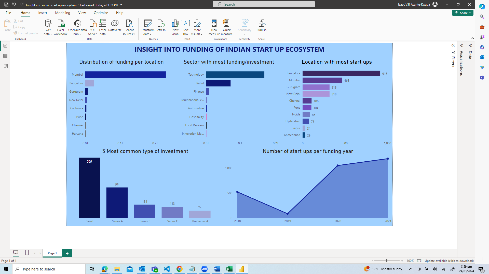

### Title:Data Analysis of Indian Start up Ecosystem

### Project Description:
India has been actively fostering the development of a thriving startup ecosystem, and the number of businesses is rising year over year. Due to its favorable startup environment, the nation has drawn a large number of investors, both domestic and foreign. Consequently, a lot of money is invested in the startup sector.This project aims to analyze funding trends in the Indian start-up ecosystem from 2018 to 2021. By examining data on funding received by start-ups and investor profiles, we seek to gain insights into the dynamics of the ecosystem and identify factors influencing funding trends. The ultimate goal is to provide recommendations for stakeholders interested in the Indian start-up market.

### Dataset
To analyze and answer some questions derived from our goal in order for informed decision making,  data on funding from  2018-2021 in the indian Start-up ecosystem was used. It has sections for the startup's founding year, location (city), industry/Sector, funders' names, investment amount and investors' names, stage/round of investment, what the company does

### Hypothesis
H0: Technology Sector receives the most investment

HA: Technology Sector does not receive the most investment

### visuals

### Author
Isaac Asante-Kwatia
